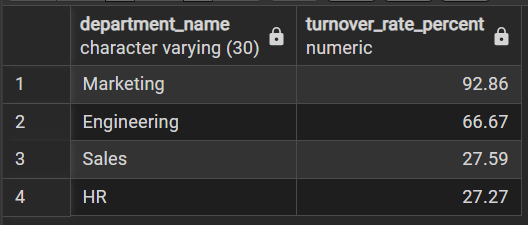
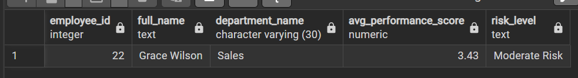
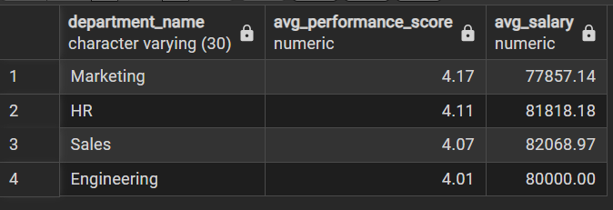

# 📊 NextGen Employee Retention & Workforce Analytics (SQL Project)

A SQL-based HR analytics project analysing employee retention, performance trends, turnover rates, and salary distribution to uncover drivers of employee attrition and workforce dynamics.

---

##  Business Overview

NextGen Corp is a rapidly growing technology company specializing in innovative software and hardware solutions. The company focuses on attracting top talent and maintaining high employee satisfaction to drive business growth.

However, leadership has identified increasing concerns regarding:

- Rising employee turnover  
- Performance variability across departments  
- Salary disparities and compensation fairness  

To address these challenges, the HR department requires a **data-driven approach** to analyse employee retention patterns, performance metrics, and salary distribution across the organisation.

---

##  Business Challenge

The HR team lacks a centralized analytical framework to understand workforce dynamics and support data-driven decision making.

Key challenges include:

- Limited visibility into **employee turnover trends**
- Difficulty identifying **employees at risk of leaving**
- Lack of clarity around **departmental performance patterns**
- Insufficient insights into **salary fairness and compensation benchmarks**

Without these insights, HR leadership cannot effectively design **retention strategies, compensation structures, or workforce planning initiatives**.

---

##  Project Objectives

This project aims to answer key HR analytics questions.

### Employee Retention Analysis
- Who are the **top 5 longest-serving employees**?
- What is the **turnover rate for each department**?
- Which employees are **at risk of leaving based on performance**?
- What are the **main reasons employees are leaving the company**?

### Performance Analysis
- How many employees **have left the company**?
- How many employees have **top performance (5.0) or low performance (<3.5)**?
- Which department has the **highest number of extreme performers**?
- What is the **average performance score by department**?

### Salary Analysis
- What is the **total salary expense for the company**?
- What is the **average salary by job title**?
- How many employees earn **above $80,000**?
- How does **performance correlate with salary across departments**?

---

##  Tools & Technologies

- **PostgreSQL**
- **SQL**
- Data Aggregation
- HR Analytics

---

## 🗂 Database Structure

The analysis was conducted using multiple relational tables:

- `employee`
- `department`
- `salary`
- `performance`
- `turnover`
- `attendance`

---

## 📊 Analysis Highlights

### Employee Retention Insights



This analysis identifies departments with the highest employee turnover rates and highlights key drivers behind employee attrition.

---

### Performance Analysis



Performance analysis evaluates employee performance distribution across departments to identify top performers and areas requiring improvement.

---

### Salary Analysis



Salary analysis examines compensation distribution and explores the relationship between salary and employee performance.

---

## 📌 Example SQL Queries

Below are key SQL queries used in the analysis.

---

### 1️⃣ Turnover Rate by Department

```sql
SELECT d.department_name,
ROUND(CAST(COUNT(t.turnover_id) AS DECIMAL) / COUNT(e.employee_id) * 100, 2)
AS turnover_rate_percent
FROM department d
JOIN employee e ON d.department_id = e.department_id
LEFT JOIN turnover t ON e.employee_id = t.employee_id
GROUP BY d.department_name
ORDER BY turnover_rate_percent DESC;
```

**Insight**

This query calculates the turnover rate across departments, helping identify departments experiencing high employee attrition.

---

### 2️⃣ Employees at Risk of Leaving

```sql
SELECT e.employee_id,
CONCAT(e.first_name, ' ', e.last_name) AS full_name,
d.department_name,
ROUND(AVG(p.performance_score), 2) AS avg_performance_score,
CASE
WHEN AVG(p.performance_score) <= 3.0 THEN 'High Risk'
WHEN AVG(p.performance_score) <= 3.5 THEN 'Moderate Risk'
ELSE 'Low Risk'
END AS risk_level
FROM employee e
JOIN performance p ON p.employee_id = e.employee_id
JOIN department d ON e.department_id = d.department_id
GROUP BY e.employee_id, full_name, d.department_name
HAVING AVG(p.performance_score) <= 3.5
ORDER BY avg_performance_score;
```

**Insight**

Identifies employees whose performance levels indicate potential risk of leaving the company.

---

### 3️⃣ Salary vs Performance Analysis

```sql
SELECT d.department_name,
ROUND(AVG(p.performance_score), 2) AS avg_performance_score,
ROUND(AVG(s.salary_amount), 2) AS avg_salary
FROM employee e
LEFT JOIN performance p ON e.employee_id = p.employee_id
LEFT JOIN salary s ON e.employee_id = s.employee_id
LEFT JOIN department d ON e.department_id = d.department_id
GROUP BY d.department_name
ORDER BY avg_performance_score DESC;
```

**Insight**

Examines how salary aligns with employee performance across departments.

---

## 📊 Key Insights

### Employee Retention

- **Marketing (92.86%) and Engineering (66.67%)** show the highest turnover rates.
- Long-serving employees were mostly hired between **2015–2016**.
- “Personal reasons” accounted for the largest proportion of exits.

### Performance Trends

- **28 out of 60 employees** have left the organisation.
- Engineering and Marketing contain the largest number of extreme performance scores.
- All departments maintain relatively strong average performance levels between **4.01 – 4.17**.

### Salary Analysis

- Total annual salary expense: **$4,850,000**
- Average salary per employee: **$80,833**
- **43.3% of employees earn above $80,000**

However, salary distribution does not consistently align with performance across departments.

---

## 📈 Business Impact

The analysis revealed several strategic insights for HR decision-making:

- Identified departments with **critical employee turnover risk**
- Highlighted **misalignment between compensation and performance**
- Provided visibility into **employee retention drivers**
- Supported **data-driven workforce planning and compensation strategy**

These insights help HR leadership:

- Improve **employee retention strategies**
- Design **fair compensation structures**
- Strengthen **performance management systems**
- Optimise **workforce planning decisions**


---

# 📁 Project Files

Download project resources below:

- 🗄 SQL Queries  
👉 [Download SQL Script](Nextgen_queries.sql)

- 📊 Project Presentation  
👉 [Download Project Overview](SQL_PROJECT.pptx)


---

##  Conclusion

This project demonstrates how SQL can be used to perform **HR analytics and workforce analysis**, uncovering patterns in employee retention, performance, and compensation structures.

By transforming HR data into actionable insights, organisations can make **better strategic decisions regarding talent management and workforce optimisation**.

---

## 👤 Author

**Oluwasegun Balogun**

Data Analyst | SQL | Power BI | Tableau | Excel  
Focused on building **data-driven solutions that translate complex data into clear business insights.**
